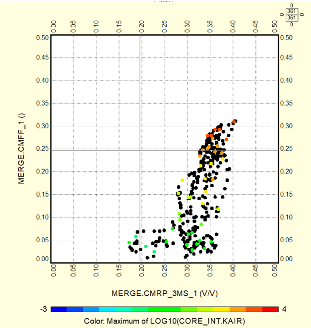
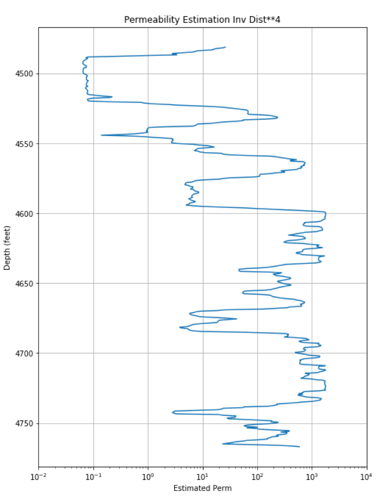

# Estimate-Core-Permeability-from-NMR-data
Estimate Core-based Permeability from NMR well log data

## Objective:
The objective of this project is to use either the Map Inversion (inverse distance**4) or kNN to estimate core-based Permeability from NMR data. The following Cross Plot is made from the NMR Effective Porosity (CMRP_3MS, x-axis) vs. the NMR Free Fluid (CMFF, y-axis).  On the z-axis there are the available core Permeability measurements shown as colored dots. This method uses the distribution of these core permeability measurements in our process to estimate core calibrated Permeability.  The NMR data in this instance is being used as a road map in making our permeability estimation.

## Map Inversion:
The Map Inversion program used in this instance is inv_dist_perm.py. In this program we read in all of the NMR data from a particular well, read in the reference core data with associated NMR values and then estimate core-based Permeability from the NMR Effective Porosity and Free Fluid over the entire well.  

## kNN:
The kNN program used in this instance is inv_dist_perm_linux_kNN2.py. Again, we read in all of the NMR data from our well, read in the reference core data with associated NMR values and then estimate core-based Permeability from the NMR Effective Porosity and Free Fluid over the entire well.  

The blue curve below shows the estimated permeability for our subject well and the red dots represent the core permeability measurements. 

 
